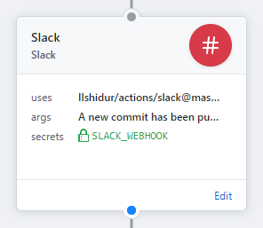
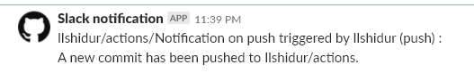

# 🚀 Slack for GitHub Actions

Sends a Slack notification. Simple as that.



*Appearance on Slack :*



This GitHub action is part of a list of Actions that are located in an other repo. Feel free to check it out : https://github.com/Ilshidur/actions.

<hr/>

## Usage

```hcl
action "Slack notification" {
  uses = "Ilshidur/action-slack@master"
  secrets = ["SLACK_WEBHOOK"]
  args = "A new commit has been pushed."
}
```

**NOTICE :** for stability purposes, it is recommended to use the action with an explicit commit SHA-1 :

`uses = "Ilshidur/action-slack@2b45998"` (=> link to the commits list : https://github.com/Ilshidur/action-slack/commits/master)

### Arguments

The argument is the message to display in the Slack notification.

**Environment variables** can be interpolated in the message using brackets (`{{` and `}}`) :

e.g.: `Action called : {{ GITHUB_ACTION }}`

*Note :* be careful to properly [format your messages for Slack](https://api.slack.com/docs/message-formatting).

#### Examples

* `args = "Hello, beautiful ! I ran a GitHub Action for you <3"`
* `args = "I showed you my commit. Please respond."`

### Environment variables

* **`SLACK_CHANNEL`** *(optional)* : overrides the default channel of the webhook.
* **`SLACK_OVERRIDE_MESSAGE`** *(optional boolean, defaults to nothing)* : set to `true` to remove the first line of the message (`Ilshidur/nicolas-coutin.fr/Deployment triggered by Ilshidur (push) :`). Any other value will override the message set in the *args* of this Action.

### Secrets

* **`SLACK_WEBHOOK`**: the Slack webhook URL (**required**, see https://api.slack.com/incoming-webhooks).
* That's all.

## Alternatives

Because open source is about everyone :

https://github.com/marketplace/actions/post-slack-message <br/>


<hr/>

<p align="center">
  Don't forget to 🌟 Star 🌟 the repo if you like this GitHub Action !<br/>
  <a href="https://github.com/Ilshidur/action-discord/issues/new">Your feedback is appreciated</a>
</p>
